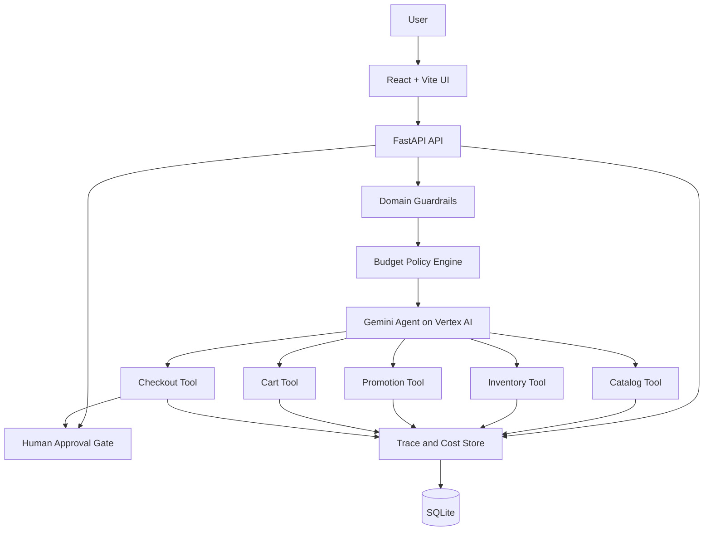

# JeolAI

**A cost-aware AI shopping agent that demonstrates how production AI applications can govern model use, tool execution, spending, and human approval.**

JeolAI combines a React + Vite interface, a FastAPI orchestration backend, Gemini on Vertex AI, deterministic commerce tools, budget-aware model routing, guardrails, execution tracing, and approval-gated checkout.

The shopping domain is intentionally bounded. The engineering value is in the control plane around the model.

> Jeol is derived from the Korean word *jeollyak* (절약), meaning thrift or economizing.

---

## Why this project exists

Many AI application demos stop when the model produces a plausible response.

Production systems must answer a harder set of questions:

- Which tools may the model invoke?
- What happens when a workflow affects money or inventory?
- How is model spend tracked across a session?
- When should the system select a lower-cost model?
- Which decisions require human approval?
- Can an operator reconstruct what happened after a failure?
- Can CI validate the application without consuming model quota?

JeolAI explores those concerns through a controlled shopping workflow.

---

## What JeolAI demonstrates

### Agent and application architecture

- Gemini function calling through Vertex AI
- FastAPI orchestration APIs
- React + Vite user and operations experience
- Multi-step shopping workflows
- Deterministic catalog, inventory, promotion, cart, and checkout tools
- Explicit separation between model reasoning and business operations

### Governance and cost controls

- Session-level budget accounting
- Configurable model-routing policies
- Retrieval reduction after warning thresholds
- Human approval before gated checkout
- Pre-model domain guardrails
- Configurable token-rate and cost estimates

### Observability and operations

- Per-call token, latency, and estimated-cost tracing
- Tool invocation history
- Policy and routing events
- Session-level execution timeline
- Resumable session summaries
- Budget status and approval state

### Engineering quality

- Pytest backend validation
- Playwright end-to-end workflows
- React production-build validation
- GitHub Actions CI
- Dependency auditing
- Docker-based local builds
- CI paths that do not require live Vertex AI calls

---

## Architecture



Gemini does not access the database directly. It may request only declared tools. The FastAPI backend validates each request, applies policy, records telemetry, and can pause checkout until a human decision is recorded.

---

## Request lifecycle

1. The user submits a shopping request.
2. Domain guardrails reject unsupported or unsafe requests before model invocation.
3. The budget policy engine selects the active model and retrieval policy.
4. Gemini may request one or more approved tools.
5. FastAPI validates tool arguments and executes deterministic business logic.
6. Traces capture model, tool, policy, latency, token, and cost events.
7. Checkout is paused when policy requires human approval.
8. The session can be summarized and resumed without replaying the entire conversation.

---

## Budget policy

| Session spend | Model policy | Retrieval policy | Checkout policy |
|---|---|---|---|
| Below 70% | Default or escalated model | Full results | Customer confirmation |
| 70% to 95% | Lower-cost model | Results capped | Customer confirmation |
| 95% or above | Lower-cost model | Results capped | Human approval required |

Thresholds, model names, and estimated token rates are configurable through environment variables.

This policy is intentionally simple enough for a workshop while still illustrating a broader production pattern: cost governance belongs in application logic, not only in billing dashboards.

---

## Repository structure

```text
.
├── backend/
│   ├── budget.py
│   ├── db.py
│   ├── gemini_client.py
│   ├── guardrails.py
│   ├── main.py
│   ├── tools.py
│   └── tracer.py
├── frontend/
│   ├── src/
│   │   ├── App.jsx
│   │   ├── api.js
│   │   ├── main.jsx
│   │   └── styles.css
│   ├── package.json
│   └── vite.config.js
├── data/
├── docs/
├── tests/
├── e2e/
├── .github/workflows/
├── Dockerfile
├── docker-compose.yml
├── playwright.config.js
├── pyproject.toml
└── requirements.txt
```

---

## Technology stack

| Layer | Technologies |
|---|---|
| Frontend | React, Vite |
| Backend | Python, FastAPI, Pydantic |
| Model platform | Gemini on Vertex AI |
| Persistence | SQLite |
| Testing | Pytest, Playwright |
| CI and security | GitHub Actions, Ruff, pip-audit, Dependabot |
| Packaging | Docker, Docker Compose |

---

## Prerequisites

- Python 3.11 or later
- Node.js 20 or later
- Google Cloud CLI
- A Google Cloud project with billing enabled
- Vertex AI API enabled
- Permission to invoke the configured Gemini models

---

## Local setup

### 1. Configure Google Cloud

```bash
gcloud auth login
gcloud auth application-default login
gcloud config set project YOUR_PROJECT_ID
gcloud auth application-default set-quota-project YOUR_PROJECT_ID
gcloud services enable aiplatform.googleapis.com
```

### 2. Run the backend

```bash
python3 -m venv venv
source venv/bin/activate
pip install -r requirements.txt

cp .env.example .env
# Set GOOGLE_CLOUD_PROJECT and model configuration in .env

uvicorn backend.main:app --reload --port 8000
```

Verify:

- `http://127.0.0.1:8000/health`
- `http://127.0.0.1:8000/docs`

### 3. Run the frontend

```bash
cd frontend
cp .env.example .env
npm install
npm run dev
```

Set the backend address in `frontend/.env`:

```env
VITE_API_BASE_URL=http://127.0.0.1:8000
```

Open the URL printed by Vite.

---

## API endpoints

| Endpoint | Purpose |
|---|---|
| `POST /chat` | Run one user turn through guardrails, policy, Gemini, and tools |
| `POST /approve` | Approve or deny a gated checkout |
| `GET /budget-status/{session_id}` | Read current spend and policy tier |
| `GET /trace/{session_id}` | Retrieve model, tool, policy, cost, and latency events |
| `POST /debug/set-spend` | Demonstrate budget tiers locally |
| `POST /end-chat` | Generate a resumable session summary |
| `DELETE /session/{session_id}` | Reset a local workshop session |
| `GET /health` | Verify provider and model configuration |

Interactive API documentation is available at `/docs`.

---

## Testing

Backend tests do not require live Vertex AI calls.

```bash
source venv/bin/activate
pytest
```

Build the React application:

```bash
cd frontend
npm ci
npm run build
```

Run Playwright workflows:

```bash
npm install
npm --prefix frontend install
npx playwright install chromium
npm run test:e2e
```

Playwright tests use mocked API responses and do not consume Gemini quota.

---

## CI and security

GitHub Actions validates:

- Python compilation
- Ruff linting
- Pytest and backend coverage
- React production build
- Playwright UI workflows
- Python dependency vulnerabilities with `pip-audit`

Dependabot is configured for Python dependencies and GitHub Actions.

Normal pull requests do not authenticate to Google Cloud or invoke Gemini. This keeps CI deterministic, repeatable, and cost-controlled.

---

## Docker

Build and run the backend and frontend:

```bash
docker compose up --build
```

The Docker configuration is intended for local development and demonstration.

A production deployment should use managed identity, restricted network access, durable storage, encrypted secrets, stricter CORS controls, and a managed transactional database.

---

## Engineering documentation

- [Architecture](docs/architecture.md)
- [System design](docs/system-design.md)
- [Deployment](docs/deployment.md)
- [Testing strategy](docs/testing-strategy.md)
- [Governance](docs/governance.md)

---

## Design decisions

### Deterministic tools instead of model-owned business logic

Catalog, inventory, promotions, cart, and checkout remain deterministic services. The model may decide which approved tool to request, but it does not directly mutate business state.

### Policy outside the prompt

Budget thresholds, model routing, retrieval limits, and approval requirements are enforced in application code. They are not left to prompt compliance.

### Human approval as workflow state

Approval is modeled as a persisted state transition, not as a conversational suggestion. This makes the decision observable and auditable.

### CI without paid model calls

The regular test suite uses mocks and deterministic paths. Live model validation is separated from ordinary pull-request checks to control cost and reduce flaky builds.

### Explicit production gaps

This repository does not present a workshop system as production-ready. Missing controls are documented rather than hidden.

---

## Production gaps

JeolAI is a production-oriented reference implementation, not a production commerce platform.

A production deployment would additionally require:

- Authentication, RBAC, and tenant isolation
- Durable encrypted session and approval state
- PostgreSQL or another managed transactional database
- Idempotency for cart and checkout operations
- Payment-provider isolation
- Prompt, model, tool, and policy versioning
- Golden datasets and continuous agent evaluation
- Centralized logs, metrics, traces, and alerts
- Organization-level budgets and chargeback
- Security review and incident runbooks

---

## Workshop use

JeolAI was designed for a hands-on workshop that teaches the system around the model:

- tool boundaries
- budget-aware routing
- approval gates
- execution tracing
- deterministic testing
- CI/CD
- production trade-offs

Workshop-specific instructions can live separately from this engineering overview so the repository remains useful both as teaching material and as a reference implementation.

---

## License

MIT
